# Welcome to Prompt Quill 

The **world's first RAG driven prompt engineer** helper at this large scale. Use it with more than 1.5 million prompts in the vector store. This number will keep growing as I plan to release ever-growing vector stores when they are available.

Prompt Quill was created to help users make better prompts for creating images. 

It is useful for poor prompt engineers like me who struggle with coming up with all the detailed instructions that are needed to create beautiful images using models like Stable Diffusion or other image generators. 

Even if you are an expert, it could still be used to inspire other prompts.

The Gradio UI will also help you to create more sophisticated text to image prompts.

Here you find just the code to run the UI or to insert data into your instance of the vector store.

# Features

* Create prompts from your input based on similar existing prompts from the vector store.
* Select the LLM to be used and set some of the parameters that get exposed by the different frameworks.
* Edit the Magic Prompt that's sent to make the LLM a prompt engineering helper.
* I have implemented Prompt Quill using llmware, llama-index and haystack. They offer different connections to vector stores. (We currently support Milvus and Qdrant.)

# The best feature :)

In the Character tab you will find "the magic prompt", which is the history that gets set when you enter your prompt to generate a new one.

Here you will get full control, and you can make it as close as possible to your personal prompting style.

Right now there are just a few examples, but if you change the Query and Answer to your type of prompts, it will generate prompts corresponding to your preferred style.
You might need to experiment with this but during development, I learned that with this you can get a powerful tool to make it generate prompts as close as possible to your style.

# Simple prompt vs Prompt Quill prompt

This is the prompt _rocket man in space_

Here we can see the image the prompt from Prompt Quill created out of _rocket man in space_.

The full prompt from Prompt Quill was:

_High-quality digital art, ultra-detailed, professional, clear, high contrast, high saturation, vivid deep blacks, crystal clear, ((rocket man in space)), wearing a full helmet and leather jacket, leather gloves, standing in front of an advanced high-tech space rocket, surrounded by the vastness of outer space, with intense, vibrant colors, colorful, dark, modern art style, the rocket illuminated by the cosmic light, the rocketman standing solo against the cosmic backdrop, bokeh effect creating a blurry background, photography-style composition, on eye level, masterpiece._

Looking at this prompt, keep in mind that you get full control about the prompt style by editing the history in the character tab.

You might wonder where the rocket is from the prompt. It is clearly not in the image and maybe it is hiding behind the guy in front.
The outcome depends on the model you use and on how many samples you take using different seeds. The example you see here is the one I liked the most from the few samples I took.
Also, the image dimensions used will have a large impact on what gets shown. A wide image will look totally different than a high image. (But that's AI image generation theories which are not part of this here.) Here, it's all just about making nicer prompts. It's up to you to create the right image setup for your prompts.
Here are a few more samples using a different model.

# Robust prompts even with no negative prompt
Here you see images comparing a regular, hand made prompt versus a prompt made by Prompt Quill.

The left is the Prompt Quill prompt and the right is the hand made prompt, they use the same settings and seed.

Also they use a very detailed handcrafted negative prompt, the right image is the nicer one.

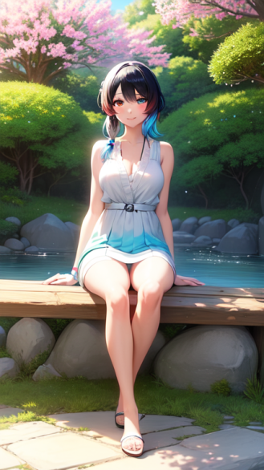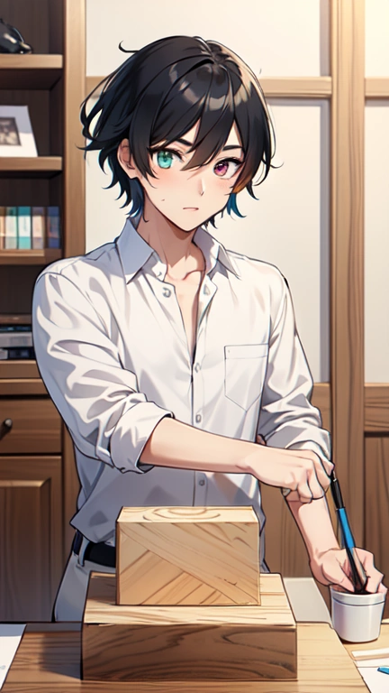

Now we see same prompts, same seed but with no negative prompt, and we can see how much the right one drifts away from the first one while the left drifts not as hard.

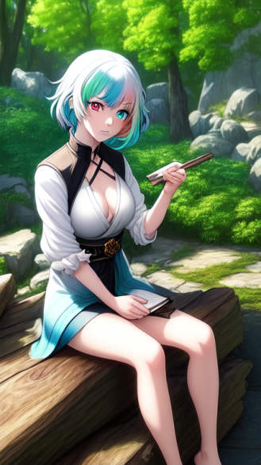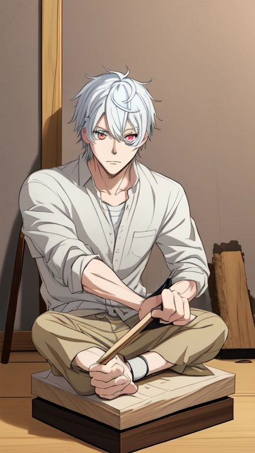

# the sail to italy example

_"sail to italy"_ would give you a prompt like this:

_Stunning aerial photograph of a sailboat gracefully navigating through the crystal-clear waters of the Mediterranean Sea, en route to Italy. The sun casts a warm golden glow on the boat, while the distant villages and medieval towns along the coastline appear as intricate, detailed miniatures in the background. The image captures the beauty of the Italian coastline, with its picturesque beaches, islands, and castles, all bathed in the warm, golden light of the setting sun. The sailboat's sails billow with the wind, creating a sense of movement and adventure in this breathtaking scene. The photograph is taken in 8K resolution, offering an incredibly detailed and immersive view of the scene, with the stars twinkling in the night sky above, creating an Aurora-style atmosphere that adds to the magic of the moment._

Here are a few samples from 8 different free online image generators:
We see the prompts are not just working for stable diffusion models.

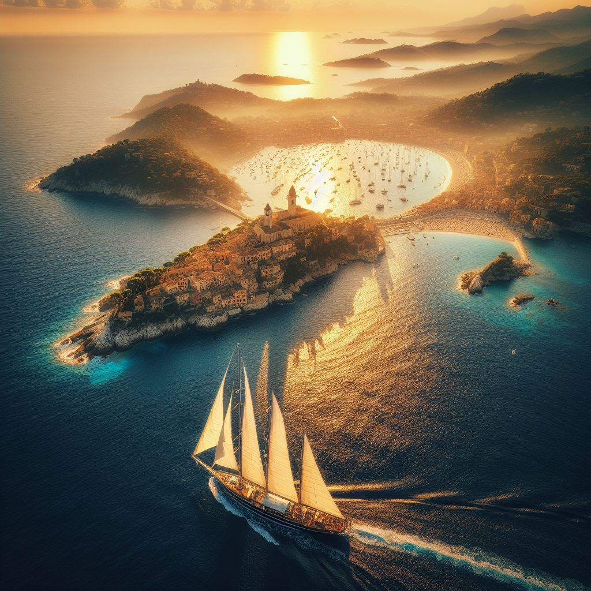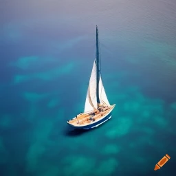
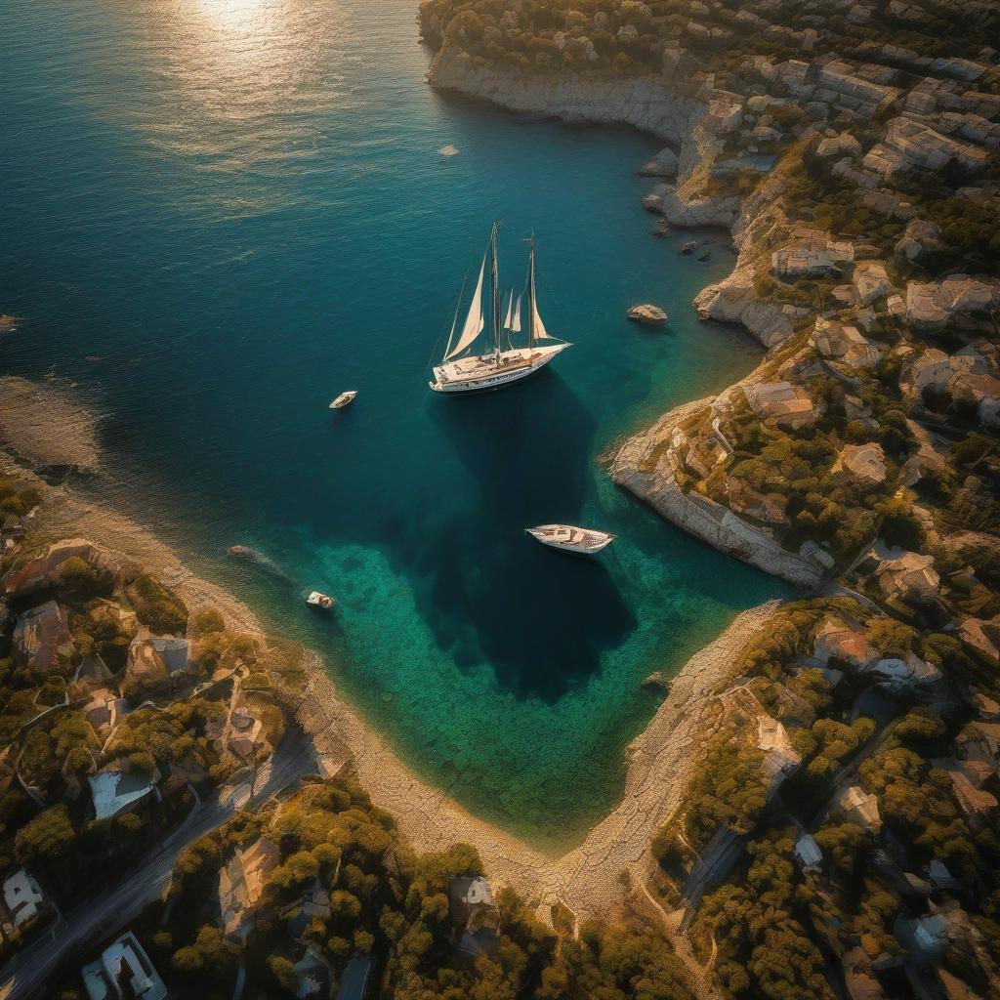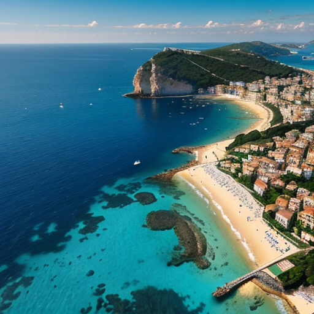
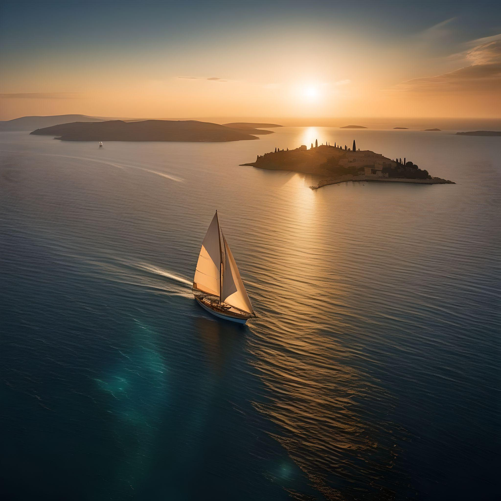

# negative prompts and model examples

Based on the information I retrieved for all those prompts data I also know the negative prompt that was used for a prompt and also I know what model was used to generate the image I took the prompt from, So why not give that information to you too.
I managed to get this working in llama-index for now but the other two will follow soon. The data will follow pretty soon to.

Here is a first sneak peek how it will look like then:

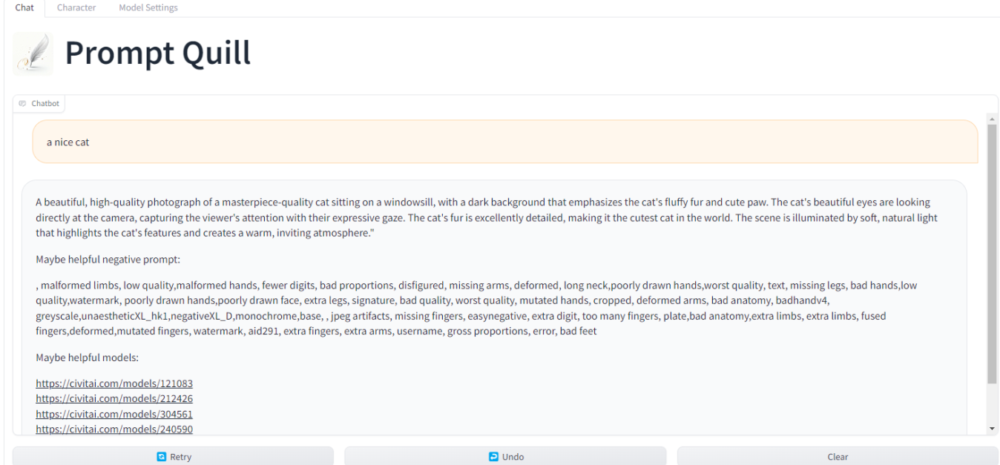

Here you see an example "a nice cat" with no negative prompt on the left and on the right same prompt and seed but with negative prompt

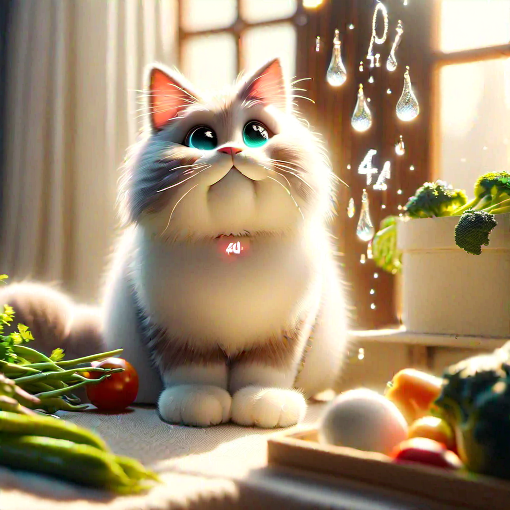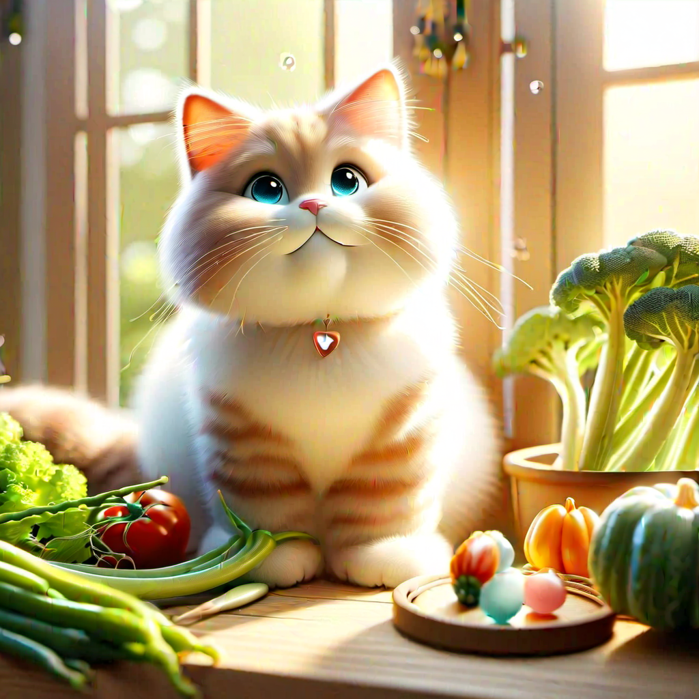

# The data needed for all the fun

To get data into your prompt quill there are two ways: the hard and the easy one ;)

The hard way is to go and get a large number of prompts and put them into a vector store. The scripts to do so are included.

For the easy way, just download more than 1.5 million prompts that are ready to go here: https://civitai.com/models/330412

# Roadmap

* Add more models to the model lists.
* Add negative prompting.
* Add model / LORA advisor.
* Add history to the conversation if not already included by the framework.
* Add longterm history by storing conversations to disk.
* Add more settings to finetune the vector search.
* Add REST API
* Build Comfyui Plugin
* Find someone do a plugin for Auto1111 :D

# Looking for a hosting solution

If you like this project, and you are willing and able to sponsor this project as a longterm host (this including the data), feel free to contact me.

# More prompts :)

If you like and can provide large numbers of prompts please get in contact with me.
I am compiling a growing vector DB which I can then share at some place where I can upload those files.

# Install

To run this thing you need to decide which RAG platform you like most (we support LLMWare, Llama-Index and Haystack), 
then you got to set up a vector store and start playing with it.

If you did download a snapshot from civitai you have to run the Qdrant vectror store.
A docker compose file you will find in the docker folder.

just cd to the qdrant folder and run:

docker compose up

this will start the qdrant server.
Once it is up and running you should find it a http://localhost:6333 .
Under collections there is a little blue arrow right and there you can upload the snapshot.
Once that is done you are ready to go to get the prompt quill running.

get into the folder of the following brands you like to run on:
llmware, llama_index or haystack

run pip install -r .\requirements.txt.

Unless you use llmware you have to do this following steps to run llama-cpp:

If you only run on CPU the last steps is

run pip install -r .\requirements_cpu.txt

If you like to run on GPU you have to set up llama-cpp and torch to run on GPU for your environment
to do this if on windows please check the file in llama-cpp_windows it will tell the further steps

On any other platform please find how you do it, I do not have any other platform. If you create a method, please let me know and I can add it here. Contributions are welcome.

Long term, I will create a one click installer but that's not today ;)

# No Feature

There is nothing preventing you from prompt injection or changing the way the LLM will behave.
This is not the focus of this project as that is a whole different story to solve.

This will become a topic once there is a hosting provider for the project.

# Contact

Please find me and join us on discord: https://discord.gg/gMDTAwfQAP

